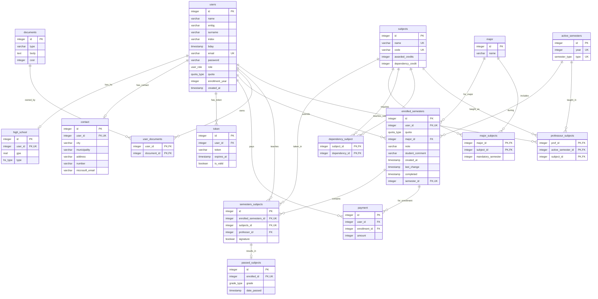

# Schema diagram

Generated from [`schema_creation.sql`](schema_creation.sql), which is the source of truth. If you change
a table there, change it here too.

Renders inline on GitHub and in the VS Code markdown preview (Ctrl+Shift+V) -
no extension or tooling needed. Relationship labels use the names from the
conceptual ER model.

## Enum types

| Type | Labels |
|------|--------|
| `user_role` | `student`, `prof`, `admin` |
| `hs_type` | `strucen`, `gimnazija` |
| `quota_type` | `privatna`, `drzavna`, `stipendija` |
| `semester_type` | `summer`, `winter` |
| `grade_type` | `6`, `7`, `8`, `9`, `10` |

## Notes

- `UK` on `enrolled_semesters.user_id` / `semester_id` is the composite
  `UNIQUE (user_id, semester_id)` - one enrolment per student per semester.
  Same for `semesters_subjects (enrolled_semesters_id, subjects_id)` and
  `active_semesters (year, type)`.
- `users` appears twice around `semesters_subjects`: once as the student, via
  `enrolled_semesters.user_id`, and once as `professor_id`. The ER model links
  the student through the enrolment, not directly.
- `dependency_subject` is `subjects` related to itself: `subject_id` is the
  dependent subject and `dependency_id` the prerequisite, with a `CHECK` that
  they differ.
- `professour_subjects` keeps the spelling used by the table in `schema_creation.sql`.
